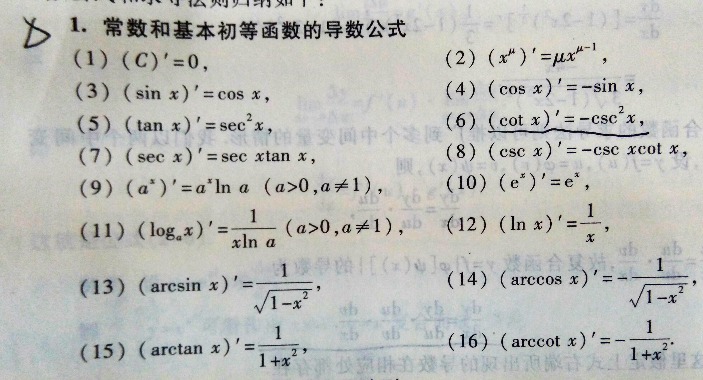
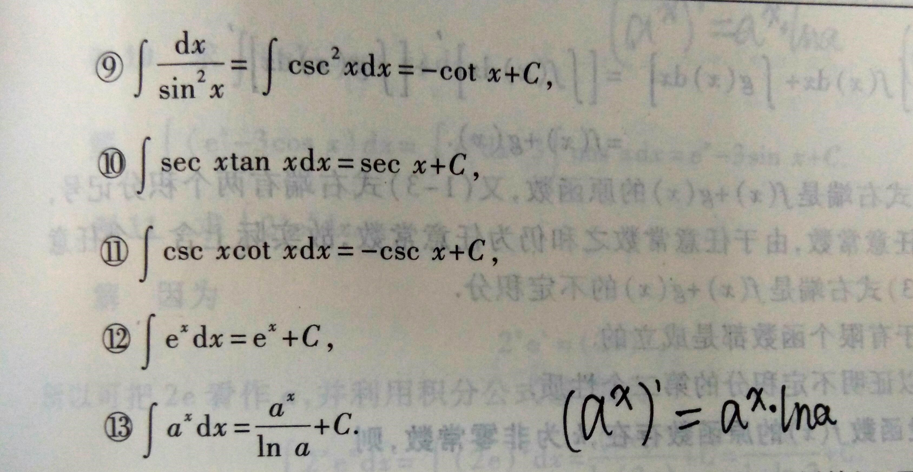
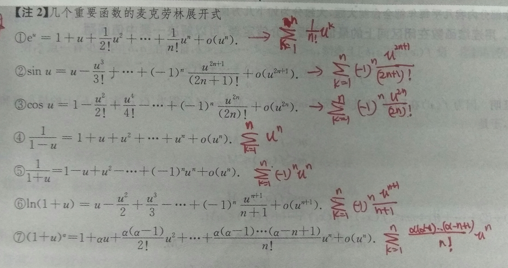

1. 点到直线
$$ {\left |{AX_0+BX_0+C} \right |} \over \sqrt{A^2+B^2} $$  
1. 和差化积  
$$ \sin \alpha + \sin \beta = 2 \sin { \left ( {\alpha + \beta } \over 2 \right ) } \cos \left ( {\alpha - \beta } \over 2 \right ) $$
$$\sin \alpha - \sin \beta = 2 \cos { \left ( {\alpha + \beta } \over 2 \right ) } \sin \left ( {\alpha - \beta } \over 2 \right ) $$
$$ \cos \alpha + \cos \beta = 2 \cos { \left ( {\alpha + \beta } \over 2 \right ) } \cos \left ( {\alpha - \beta } \over 2 \right )$$
$$ \cos \alpha - \cos \beta = -2 \sin { \left ( {\alpha + \beta } \over 2 \right ) } \sin \left ( {\alpha - \beta } \over 2 \right )$$  
1. 积化和差  
$$ \sin \alpha \cos \beta = \frac{1}{2} \left [ \sin(\alpha+\beta)+\sin(\alpha-\beta) \right ]$$
$$ \cos \alpha \sin \beta = \frac{1}{2} \left [ \sin(\alpha+\beta)-\sin(\alpha-\beta) \right ]$$
$$ \cos \alpha \cos \beta = \frac{1}{2} \left [ \cos(\alpha+\beta)+\cos(\alpha-\beta) \right ]$$
$$ \sin \alpha \sin \beta =- \frac{1}{2} \left [ \cos(\alpha+\beta)-\cos(\alpha-\beta) \right ]$$
1. 万能公式  
$$ \sin\alpha=\frac{2\tan \frac{\alpha}{2}}{1+\tan^2 \frac{\alpha}{2}}$$
$$ \cos \alpha =\frac {1-\tan^2\frac{\alpha}{2}}{1+\tan^2\frac{\alpha}{2}}$$
$$ \tan\alpha=\frac{2\tan \frac{\alpha}{2}}{1-\tan^2 \frac{\alpha}{2}}$$
1. 半角公式  
$$ \sin \left(\frac{\alpha}{2} \right)=\pm \sqrt{\left(\frac{1-cos \alpha}{2}\right)}$$
$$ \cos \left(\frac{\alpha}{2} \right)=\pm \sqrt{\left(\frac{1+cos \alpha}{2}\right)}$$
$$ \tan \left(\frac{\alpha}{2} \right)=\pm \sqrt{\left(\frac{1-cos \alpha}{1+cos \alpha}\right)}$$  
1. f(×)关于x=T对称  充要条件
f(x)=f(2T-×)  ；f(T+x)=f(T-x)

1. 奇函数与偶函数的表达  
  1.1. 奇 F(x)=f(x)-f(-x)  
  1.1. 偶 F(x)=f(x)+f(-x)  
  1.1. 任意 f(x)=1/2[f(x)-f(-x)]+1/2 f(x)+f(-x)]  
1. 最大值&最小值  
Max{f(x),g(x)}=1/2[f(x)+g(x) +|f(x)-g(x)|]  
Min{f(x),g(x)}=1/2[f(x)+g(x)-|f(x)-g(x)|]  

1. f(x)  g(x)互为反函数  
f(g(x))=x $\rightarrow$  g(f(x))  

数列收敛于A,则任意子数列收剑于A  
单调数列的某一子数列收敛于A,则该数列收敛于A  
数列{2n}与{2n+1}都收敛于A,则数列必收敛于A  

​1. 单调有界数列必有极限  
1. 连续的定义  
$$ \lim_{x\rightarrow a}f(x)=A$$
$$ \lim_{\Delta\rightarrow0}\Delta y=\lim_{\Delta x \rightarrow 0 } f(x+ \Delta x) - f(x)=0$$
1. 常用等价无穷小 $ x \rightarrow 0$  
$ \sin x \sim x$ ; $ \tan x \sim x$ ; $ \arcsin x \sim x$ ; $ \arctan x \sim x$ ; $ \ln({1+x}) \sim x $ ; $ e^x -1 \sim x$ ; $ a^x -1 \sim x \ln a $ ; $ 1-\cos x \sim \frac{1}{2} x^2 $ ; $ {(1+x)}^a -1 \sim ax$  
1. f(0)=1 时 等价无穷小
$$ \lim_{x \rightarrow 0 } {{\int_0^x f(x)dt} \over {x}} =1$$  

1. 极限比较  
$$ f(x) \geq g(x) \rightarrow \lim f(x) \geq \lim g(x) $$
$$ \lim f(x) > \lim g(x) \rightarrow f(x) > g(x) $$  
1. 敛散  
$ \lim_{x→1} \frac{1}{(x-1)^{α+1}}=
\left\{
  \begin{aligned}
  &0 , (a<-1) \\
  &1 , (a=-1) \\
  &\infty ,(a>-1)
  \end{aligned}
  \right.
$
$$ [u(x)v(x)w(x)]'= u'(x)v(x)w(x)+u(x)v'(x)w(x)+u(x)v(x)w'(x)$$
$$ \frac{\partial f}{\partial x} \equiv \frac{\partial f}{\partial y} \equiv 0\ \leftrightarrow df({x,y}) \equiv 0 $$

1. 球体积  
$$ V=\frac{4}{3} \pi R^3$$
1. 表面积  
$$ S= 4 \pi R^2$$

​1. 定积分定义  
$$ \int_a^b f(x)dx= \lim_{n \rightarrow \infty } \sum_{i=1}^n \frac{f \left( a+ \frac{b-a}{n}i \right)(b-a)}{n}$$  
1. 连续函数必有原函数  
 1.1. 含有第一类间断点，无穷间断点的函数在包含间断点的区间没有原函数  
 1.1. 跳跃间断点可以有原函数

​1. 基本积分表

$$ \int \tan x dx = - \ln |\cos x | +C$$
$$ \int cot x dx = \ln|\sin x| +C$$
$$ \int \sec x dx = \ln |\sec x+ \tan x| +C$$
$$ \int \csc x dx = \ln|csc x-\cot x | +C $$
$$ \int \frac{dx}{a^2+x^2}=\frac{1}{a} \arctan \frac{x}{a} +C $$
$$ \int \frac{dx}{x^2-a^2}=\frac{1}{2a} \ln \left| \frac{x-a}{x+a} \right| +C$$
$$ \int \frac{dx}{\sqrt{a^2-x^2}}=\arcsin \frac{x}{a}+C$$
$$ \int \frac {dx}{\sqrt{x^2+a^2}}=\ln {(x+ \sqrt{x^2+a^2})}+C$$
$$ \int \frac{dx}{\sqrt{x^2-a^2}}= \ln | x+\sqrt{x^2-a^2}|+C$$

1. 泰勒公式  
$ e^{1+x}=e+ex+e \frac{x^2}{2!} + e \frac{x^3}{3!}+e\frac{x^4}{4!}$

$$ \sin x=x-\frac{x^3}{3!}+o(x^3)$$
$$ \cos x=1-\frac{x^2}{2!}+\frac{x^4}{4!}+o(x^4)$$
$$ \arcsin x=x+\frac{x^3}{3!}+o(x^3)$$
$$ \tan x=x+\frac{x^3}{3}+o(x^3)$$
$$ \arctan x=x-\frac{x^3}{3}+o(x^3)$$

1. 几个初等函数的n阶导数公式  

$$ \int_0^\frac{\pi}{2} sin^n θ d \theta =\int_0^\frac{\pi}{2} \cos^n \theta d \theta =
\left\{
\begin{aligned}
  &\frac{n-1}{n}\cdot\frac{n-3}{n-2} \cdots \frac{3}{4}\cdot\frac{1}{2}\cdot\frac{\pi}{2}\mbox{  n为正偶数} \\
  &\frac{n-1}{n}\cdot\frac{n-3}{n-2}\cdots\frac{4}{5}\cdot\frac{2}{3}\mbox{  n为大于1的正奇数}
\end{aligned}
\right.
$$
​1. 经典不等式  
$$e^x \geq x+1 ; x-1 \geq \ln x ; \frac{1}{1+x} < \ln \left( 1+ \frac{1}{x} \right) < \frac{1}{x}$$  
$$ e^{αx} \gg x^b \gg \ln^y x $$
$$ 2\left| ab \right| \leq a^2+b^2$$
$$ \left| a \pm b \right| \leq |a|+|b|$$
$$ \left| |a| - |b| \right| \leq |a-b|$$
$$\sqrt{ab} \leq \frac{a+b}{2} \leq \sqrt{\frac{a^2+b^2}{2}}$$
当 x>0,y>0,p>0,q>0,$\frac{1}{p}+\frac{1}{q}=1 \rightarrow xy \leq \frac{x^p}{p}+\frac{y^q}{q}$  
$$(a^2+b^2)(c^2+d^2) \geq (ac+bd)^2$$  
$$ [\int_a^b f(x)g(x)dx]^2 \leq \int_a^b f^2(x)dx\cdot \int_a^b g^2(x)dx$$  
$$\mbox{当} p>1, \frac{1}{p}+\frac{1}{q}=1 \mbox{时；} \left| \int_a^b f(x) \cdot g(x)dx\right| \leq \left[ \int_a^b \left| f(x) \right|^p dx \right] ^\frac{1}{p} \cdot \left[ \int_a^b \left| g(x) \right|^q dx \right] ^\frac{1}{q}$$  

​
1. 若$\int^{(n−1)}(x)$最多只有一个实零点,则f(x)最多只有n个不同实零点
1. $f^′(x)≠0$ 且连续⇒ f(x)单调  
1. 连续的**奇**函数的**一  切**原函数都是**偶**函数
1. 连续的**偶**函数的**仅有一个**原函数都是**奇**函数  
1. 变限积分 存在必连续  
1. 可积函数在区间内必有界 （二元也成立）  
1. f(x)是以ㄒ为周期的可积函数  
$$ \int_0^\frac{\pi}{4} \sin x dx =1- \frac{\sqrt{2}}{2}$$  
$$ \int_\frac{\pi}{4}^\frac{\pi}{2} \sin x dx =\frac{\sqrt{2}}{2}$$  
$$ \int_0^\frac{\pi}{2} \sin x dx = 1$$  
$$ \int_0^\pi \sin x dx =2$$  
1. 积分递归解法  

1. 极值判定充分条件  
    1. f '(x~0~)左右异号→极值点  
$
\left\{
\begin{aligned}
&f'=0 \\
&f''(x_0) \neq 0
\end{aligned}
\right.
\rightarrow \mbox{极值点}
$  
    1. 当$ f^{(n)} (x_0) \neq 0$
        1. n为偶  
        $f^{(n)} (x_0) \leq 0 $ → 极大值  
        $f^{(n)} (x_0) \geq 0 $ → 极小值  
        1. n为奇  
            拐点  
1. 多元函数极值与最值  
  1.1. 二元函数取极值的必要条件
    设z=f(x,y)在点($x_0,y_0$)
    $\left\{
      \begin{aligned}
      &\mbox{一阶偏导数存在}\\
      &\mbox{取极值}
      \end{aligned}
      \right.$
    则，$ f_x^'(x_0,y_0)=0 , f_y^'(x_0,y_0)=0 $
  
1. 凹凸性定义  
    1. 凹  $ f(\frac{x_1+x_2}{2}) < \frac{f(x_1)+f(x_2)}{2}$  
    1. 凹  $ f[λx_1 +(1-λ)x_2] \leq λf(x_1)+(1-λ)f(x_2)$  
1. 极值点与拐点不要求导数存在  
  
1. 曲率半径  
$ k= \frac{|y''|}{{(1+y'^2)}^{3 \over 2}}$  
R= $ \frac{1}{k}=\frac{{(1+y'^2)}^{3 \over 2}}{|y''|}$  
1. 弧长L=$ \int_α^β \sqrt{r^2(θ)+[r'(θ)]^2}dθ$  
1. 曲边扇形面积 S=$ \frac{1}{2} \int_α^β|r_1^2(θ)-r_2^2(θ)|dθ$  
1. 极座标交换积分次续  
  
1. 反常积分审敛  

1. 一阶微分方程
  
1. 一阶微分方程  
    当 $ u=\frac{y}{x} ⇉ y=ux\frac{dy}{dx}=u+x\frac{du}{dx}$  
  
  
  

隐藏
[comment]: <> (This is a comment, it will not be included)
[comment]: <> (in  the output file unless you use it in)
[comment]: <> (a reference style link.)
[//]: <> (This is also a comment.)
[//]: # (This may be the most platform independent comment)
