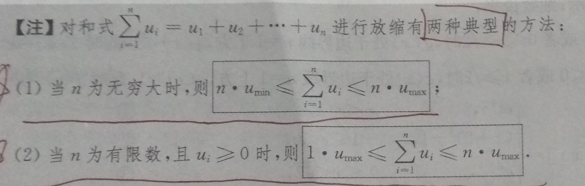
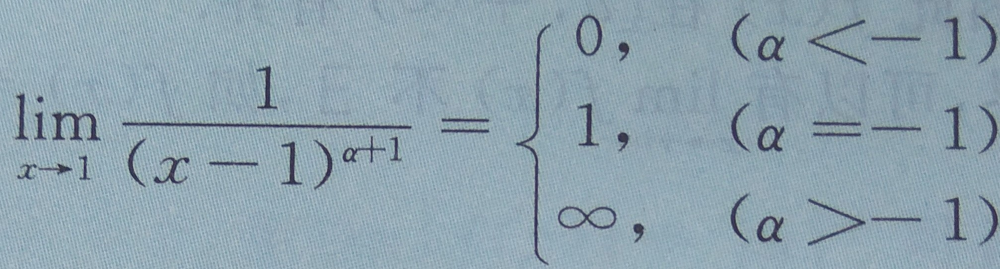
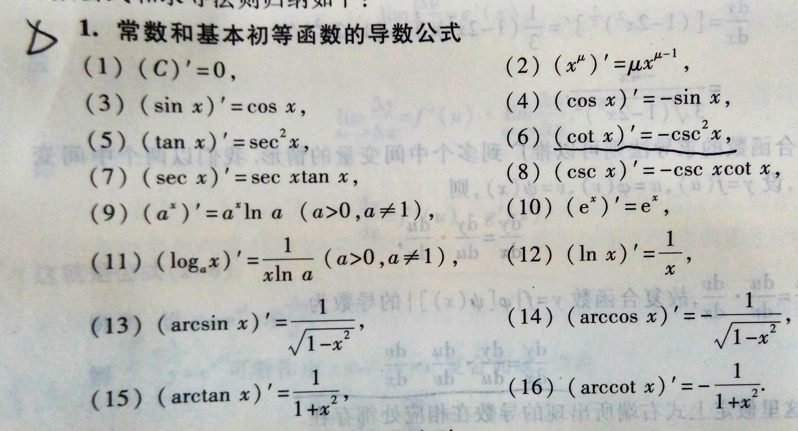

1. 点到直线
$$ {\left |{AX_0+BX_0+C} \right |} \over \sqrt{A^2+B^2} $$  
1. 和差化积  
$$ \sin \alpha + \sin \beta = 2 \sin { \left ( {\alpha + \beta } \over 2 \right ) } \cos \left ( {\alpha - \beta } \over 2 \right ) $$
$$\sin \alpha - \sin \beta = 2 \cos { \left ( {\alpha + \beta } \over 2 \right ) } \sin \left ( {\alpha - \beta } \over 2 \right ) $$
$$ \cos \alpha + \cos \beta = 2 \cos { \left ( {\alpha + \beta } \over 2 \right ) } \cos \left ( {\alpha - \beta } \over 2 \right )$$
$$ \cos \alpha - \cos \beta = -2 \sin { \left ( {\alpha + \beta } \over 2 \right ) } \sin \left ( {\alpha - \beta } \over 2 \right )$$  
1. 积化和差  
$$ \sin \alpha \cos \beta = \frac{1}{2} \left [ \sin(\alpha+\beta)+\sin(\alpha-\beta) \right ]$$
$$ \cos \alpha \sin \beta = \frac{1}{2} \left [ \sin(\alpha+\beta)-\sin(\alpha-\beta) \right ]$$
$$ \cos \alpha \cos \beta = \frac{1}{2} \left [ \cos(\alpha+\beta)+\cos(\alpha-\beta) \right ]$$
$$ \sin \alpha \sin \beta =- \frac{1}{2} \left [ \cos(\alpha+\beta)-\cos(\alpha-\beta) \right ]$$
1. 万能公式  
$$ \sin\alpha=\frac{2\tan \frac{\alpha}{2}}{1+\tan^2 \frac{\alpha}{2}}$$
$$ \cos \alpha =\frac {1-\tan^2\frac{\alpha}{2}}{1+\tan^2\frac{\alpha}{2}}$$
$$ \tan\alpha=\frac{2\tan \frac{\alpha}{2}}{1-\tan^2 \frac{\alpha}{2}}$$
1. 半角公式  
$$ \sin \left(\frac{\alpha}{2} \right)=\pm \sqrt{\left(\frac{1-cos \alpha}{2}\right)}$$
$$ \cos \left(\frac{\alpha}{2} \right)=\pm \sqrt{\left(\frac{1+cos \alpha}{2}\right)}$$
$$ \tan \left(\frac{\alpha}{2} \right)=\pm \sqrt{\left(\frac{1-cos \alpha}{1+cos \alpha}\right)}$$  
1. f(×)关于x=T对称  充要条件
f(x)=f(2T-×)  ；f(T+x)=f(T-x)

1. 奇函数与偶函数的表达  
1.1. 奇 F(x)=f(x)-f(-x)  
1.1. 偶 F(x)=f(x)+f(-x)  
1.1. 任意 f(x)=1/2[f(x)-f(-x)]+1/2 f(x)+f(-x)]  
1. 最大值&最小值  
Max{f(x),g(x)}=1/2[f(x)+g(x) +|f(x)-g(x)|]  
Min{f(x),g(x)}=1/2[f(x)+g(x)-|f(x)-g(x)|]  

1. f(x)  g(x)互为反函数  
f(g(x))=x $\rightarrow$  g(f(x))  

1. 单调有界数列必有极限  
1. 连续的定义  
$$ \lim_{x\rightarrow a}f(x)=A$$
$$ \lim_{\Delta\rightarrow0}\Delta y=\lim_{\Delta x \rightarrow 0 } f(x+ \Delta x) - f(x)=0$$
1. 常用等价无穷小 $ x \rightarrow 0$  
$ \sin x \sim x$ ; $ \tan x \sim x$ ; $ \arcsin x \sim x$ ; $ \arctan x \sim x$ ; $ \ln({1+x}) \sim x $ ; $ e^x -1 \sim x$ ; $ a^x -1 \sim x \ln a $ ; $ 1-\cos x \sim \frac{1}{2} x^2 $ ; $ {(1+x)}^a -1 \sim ax$  
1. f(0)=1 时 等价无穷小
$$ \lim_{x \rightarrow 0 } {{\int_0^x f(x)dt} \over {x}} =1$$  

1. 极限比较  
$$ f(x) \geq g(x) \rightarrow \lim f(x) \geq \lim g(x) $$
$$ \lim f(x) > \lim g(x) \rightarrow f(x) > g(x) $$  

$$ [u(x)v(x)w(x)]'= u'(x)v(x)w(x)+u(x)v'(x)w(x)+u(x)v(x)w'(x)$$
$$ \frac{\partial f}{\partial x} \equiv \frac{\partial f}{\partial y} \equiv 0\ \leftrightarrow df({x,y}) \equiv 0 $$

1. 球体积  
$$ V=\frac{4}{3} \pi R^3$$
1. 表面积  
$$ S= 4 \pi R^2$$
